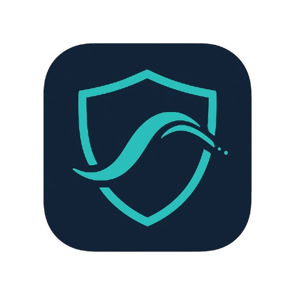

# Silkret



Silkret is a lightweight, autonomous, and privacy-focused local proxy application that allows users to bypass censorship and protect their online activity. It provides anti-DPI (Deep Packet Inspection) protection, request fragmentation, and decoy packets to ensure maximum privacy.  

---

## Features

- **Autonomous Proxy** – Automatically sets the system proxy to Silkret's local proxy.  
- **Anti-DPI & Fragmentation** – Avoids Deep Packet Inspection and splits packets to evade traffic analysis.  
- **Decoy Packets** – Sends harmless traffic to confuse network monitoring.  
- **Flexible Browser Usage** – Works with ProxyEmpire Proxy Manager or any custom browser proxy configuration.  
- **Open Source** – Fully auditable and free to use or modify.  

---

## Installation

### Windows

1. Download the latest release from the [Download](download.html) page.  
2. Run `Silkret.exe` and follow the instructions.  
3. By default, Silkret sets your system proxy to `127.0.0.1:8412`.  

---

## Tutorial

See the [Tutorial](tutorial.html) page for step-by-step instructions, including browser integration via ProxyEmpire Proxy Manager:

1. Silkret automatically sets the system proxy.  
2. For browser usage:  
   - Install **ProxyEmpire Proxy Manager**.  
   - Create a new profile: Host → `127.0.0.1`, Port → `8412` (or your custom port).  
   - Click **Connect**.  
3. Your traffic is now routed through Silkret's secure proxies.  

---

## Source

Silkret is fully open-source. You can review and contribute to the source code on the [Source](source.html) page.  

---

## Usage

```bash
# Start Silkret
Silkret.exe

# Stop Silkret
Press Ctrl+C in the terminal
